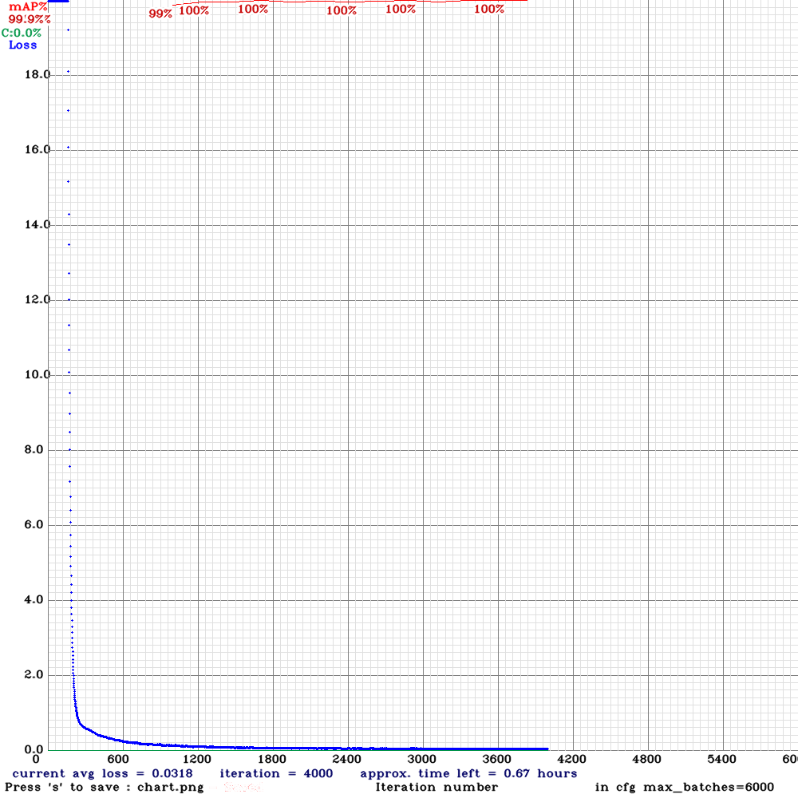
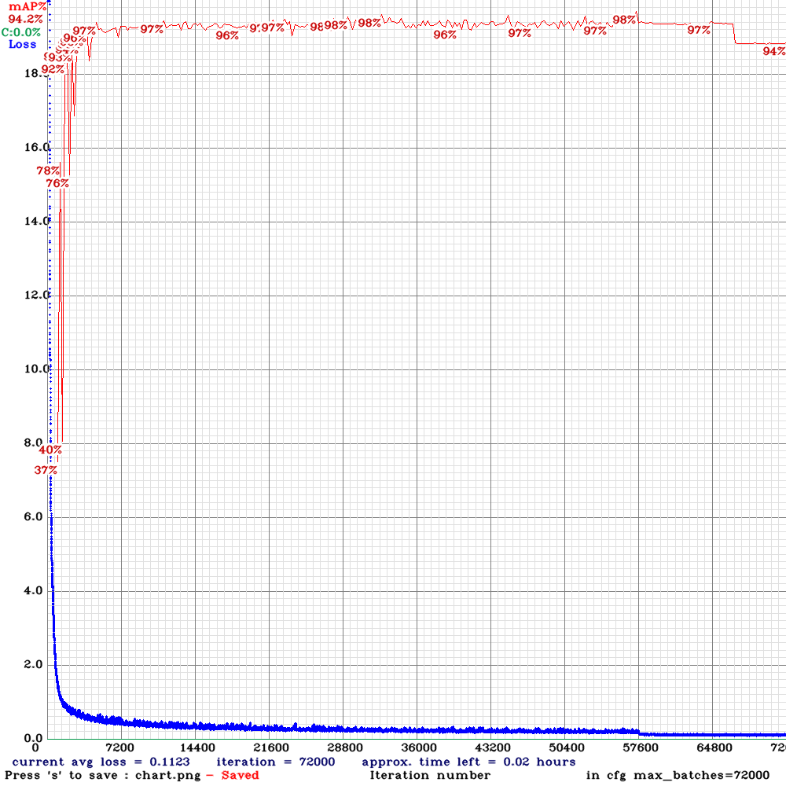

# Experiments for LP detection and recognition

This provides a summary and key metrics of the main the experiments performed for LP detection and recognition.

## Notes

- All experiments have an `#[ID]` associated with it.
- Only significant experiments are/will be added to this document, however, all experiments that were tried will be uploaded at a later stage.
- All required files to run/re-produce each experiment are provided apart from the datasets, to obtain all the datasets, refer to the datasets directory.
- A more detailed experiments/results page will be created after all experiments are done and the final method/approach/configurations are chosen.

## Datasets used

| Dataset      | # Samples | Resolution | Country   | Notes                |
|--------------|-----------|------------|-----------|----------------------|
| Caltech Cars | 124       | 896x592    | American  | car, rear view       |
| English LP   | 509       | Mixed      | EU        | car/truck, rear view |
| OpenALPR EU  | 108       | Mixed      | EU        | car, rear/front view |
| AOLP         | 2049      | Mixed      | Taiwanese | cars/motorbikes, r/f |
| UFPR-ALPR    | 4500      | 1920x1080  | Brazilian | car/motorbike, rear  |
| **Total**    | **7290**  |

- All datasets were split into training, validation, and testing sets using `70%`, `20%`, `10%` ratios respectively.
    - Apart from `UFPR-ALPR`, which has a fixed train, val, and test sets.
- To minimise/avoid bias of the random division of the different sets, each experiment is ran for 5 times using a different random seed, and an average of all the metrics for all 5 runs is taken.

## LP detection experiments

### `Det_#0 - Baseline/initial experiment/benchmark`

- This experiment/method refers to the first method and configurations tried.
- Here the default YOLOv4-tiny darknet configuration is used with transfer learning to re-train the network on all the datasets (LP patches) using the pre-trained weights on the COCO dataset.
- No pre or post processing is done, no additional methods/techniques are introduced, just the plain detector, this was done to get a baseline/benchmark for all the rest of the experiments.

#### Experiment files

- Configuration: [0_det-yolov4-tiny-obj.cfg](LP_det/0/0_det-yolov4-tiny-obj.cfg)
- Data: [obj.data](LP_det/0/obj.data)
- Names: [obj.names](LP_det/0/obj.names)
- Final weights chosen: [yolov4-tiny-obj_3000.weights](https://drive.google.com/file/d/12LzeZnmlpttw-EuTA2pFlvxG1jnsubfz/view?usp=sharing)

#### Results

| Thresh (Confidence, IoU)     | Weights | Set   | mAP(%) | Avg IoU (%) | Precision | Recall | F1   | TP   | FP | FN |
|------------------------------|---------|-------|--------|-------------|-----------|--------|------|------|----|----|
| (0.75, 0.5)                  | 3000    | Train | 99.92  | 86.25       | 1         | 1      | 1    | 3770 | 11 | 10 |
| (0.75, 0.5)                  | 3000    | Test  | 99.71  | 83.83       | 0.97      | 0.99   | 0.98 | 2060 | 60 | 27 |
| (0.75, 0.5)                  | Last    | Train | 99.99  | 88.37       | 1         | 1      | 1    | 3768 | 7  | 12 |
| (0.75, 0.5)                  | Last    | Test  | 99.77  | 84.37       | 0.98      | 0.97   | 0.97 | 2027 | 46 | 60 |

* Note: The weights column refers to the saved weights at that epoch/iteration. "Last" refers to the last weights saved for the last iteration performed.

## LP recognition

### `Rec_#1 - Baseline/initial experiment/benchmark`

- This experiment is very similar to the `#0` LP detection experiment.
- Also no pre/post processing done. All default configurations of YOLOv4-tiny re-trained using all LP character patches cropped.

#### Experiment files

- Configuration: [1_rec-yolov4-tiny-obj.cfg](LP_rec/1/1_rec-yolov4-tiny-obj.cfg)
- Data: [0_rec-obj.data](LP_rec/1/0_rec-obj.data)
- Names: [lp_rec_obj.names](LP_rec/1/lp_rec_obj.names)
- Final weights chosen: [1_rec-yolov4-tiny-obj_58000.weights](https://drive.google.com/file/d/1ALb1TVfz49JXmlZ9DTr6AgnNRMidM8mz/view?usp=sharing)

#### Results

| Thresh      | Weights | Set   | mAP(%) | Avg IoU (%) | Precision | Recall | F1   | TP    | FP  | FN   |
|-------------|---------|-------|--------|-------------|-----------|--------|------|-------|-----|------|
| (0.75, 0.5) | Best    | Train | 99.99  | 88.38       | 1         | 1      | 1    | 24974 | 6   | 19   |
| (0.75, 0.5) | Best    | Val   | 98.46  | 85.78       | 0.99      | 0.93   | 0.96 | 9130  | 77  | 695  |
| (0.75, 0.5) | Best    | Test  | 94.24  | 85.24       | 0.99      | 0.9    | 0.94 | 12924 | 162 | 1482 |
| (0.75, 0.5) | 58000   | Train | 99.97  | 89.35       | 1         | 1      | 1    | 24970 | 3   | 23   |
| (0.75, 0.5) | 58000   | Test  | 95.06  | 85.45       | 0.99      | 0.91   | 0.95 | 13066 | 152 | 1340 |

* Note: "Best" weights refers to the best weights saved for the validation set during training. Most of the time this is not the best performing model for the test set. So multiple promising weights are tried to get optimal results on the test set.

| Results for each class/character                                    |
|---------------------------------------------------------------------|
| detections_count = 19901, unique_truth_count = 14406                |
| class_id = 0, name = 0, ap = 99.16%      (TP = 737, FP = 16)        |
| class_id = 1, name = 1, ap = 99.97%      (TP = 882, FP = 2)         |
| class_id = 2, name = 2, ap = 100.00%     (TP = 501, FP = 3)         |
| class_id = 3, name = 3, ap = 99.69%      (TP = 632, FP = 0)         |
| class_id = 4, name = 4, ap = 99.87%      (TP = 807, FP = 1)         |
| class_id = 5, name = 5, ap = 99.52%      (TP = 755, FP = 16)        |
| class_id = 6, name = 6, ap = 99.76%      (TP = 900, FP = 2)         |
| class_id = 7, name = 7, ap = 98.06%      (TP = 673, FP = 2)         |
| class_id = 8, name = 8, ap = 96.93%      (TP = 1016, FP = 38)       |
| class_id = 9, name = 9, ap = 99.77%      (TP = 1086, FP = 3)        |
| class_id = 10, name = A, ap = 99.55%     (TP = 1528, FP = 5)        |
| class_id = 11, name = B, ap = 92.79%     (TP = 365, FP = 2)         |
| class_id = 12, name = C, ap = 99.44%     (TP = 175, FP = 0)         |
| class_id = 13, name = D, ap = 98.35%     (TP = 97, FP = 16)         |
| class_id = 14, name = E, ap = 91.14%     (TP = 134, FP = 0)         |
| class_id = 15, name = F, ap = 99.17%     (TP = 43, FP = 0)          |
| class_id = 16, name = G, ap = 95.89%     (TP = 146, FP = 0)         |
| class_id = 17, name = H, ap = 100.00%            (TP = 99, FP = 0)  |
| class_id = 18, name = I, ap = 90.92%     (TP = 53, FP = 0)          |
| class_id = 19, name = J, ap = 99.31%     (TP = 144, FP = 0)         |
| class_id = 20, name = K, ap = 79.86%     (TP = 115, FP = 0)         |
| class_id = 21, name = L, ap = 99.81%     (TP = 143, FP = 0)         |
| class_id = 22, name = M, ap = 84.20%     (TP = 165, FP = 31)        |
| class_id = 23, name = N, ap = 87.19%     (TP = 21, FP = 0)          |
| class_id = 24, name = O, ap = 53.81%     (TP = 34, FP = 10)         |
| class_id = 25, name = P, ap = 99.98%     (TP = 287, FP = 1)         |
| class_id = 26, name = Q, ap = 73.60%     (TP = 26, FP = 3)          |
| class_id = 27, name = R, ap = 99.32%     (TP = 140, FP = 0)         |
| class_id = 28, name = S, ap = 90.50%     (TP = 201, FP = 0)         |
| class_id = 29, name = T, ap = 100.00%            (TP = 112, FP = 0) |
| class_id = 30, name = U, ap = 100.00%            (TP = 129, FP = 0) |
| class_id = 31, name = V, ap = 99.97%     (TP = 169, FP = 1)         |
| class_id = 32, name = W, ap = 95.17%     (TP = 120, FP = 0)         |
| class_id = 33, name = X, ap = 99.46%     (TP = 96, FP = 0)          |
| class_id = 34, name = Y, ap = 100.00%            (TP = 274, FP = 0) |
| class_id = 35, name = Z, ap = 99.90%     (TP = 261, FP = 0)         |