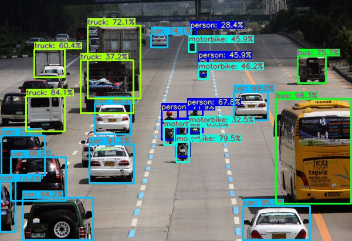

# YOLOv4

This is a directory for running YOLOv4.

## Dependencies

```shell
python3 -m pip install -U pip setuptools wheel
python3 -m pip install numpy
python3 -m pip install opencv-python
```

### Tensorflow 2

```shell
# For CPU:
python3 -m pip install tensorflow

# For GPU:
python3 -m pip install tensorflow-gpu
```

## Download weights

- [yolov4-tiny.conv.29](https://drive.google.com/file/d/1WtOuGfUgNyNfALo5_VhQ1kb5QenRE0Gt/view?usp=sharing)
- [yolov4-tiny.weights](https://drive.google.com/file/d/1GJwGiR7rizY_19c_czuLN8p31BwkhWY5/view?usp=sharing)
- [yolov4-tiny-relu.weigths(incomplete)](https://drive.google.com/file/d/1K1Nh9j0K-Bj4w2qa_9cE0NrK9vz6BhOF/view?usp=sharing)
- [yolov4.conv.137](https://drive.google.com/file/d/1li1pUtqpXj_-ZXxA8wJq-nzW8h2HWsrP/view?usp=sharing)
- [yolov4.weights](https://drive.google.com/file/d/15P4cYyZ2Sd876HKAEWSmeRdFl_j-0upi/view?usp=sharing)
- [coco.names](https://github.com/hhk7734/tensorflow-yolov4/tree/master/test/dataset)

Note: Place the weights in the `/weights` directory.


## Performance


## To test inference

Open and run `testing_inference.py`

## To test at a lower level and using a webcam in real-time

Open the `testing_yolov4.ipynb` notebook and execute the cells.

Example result:

