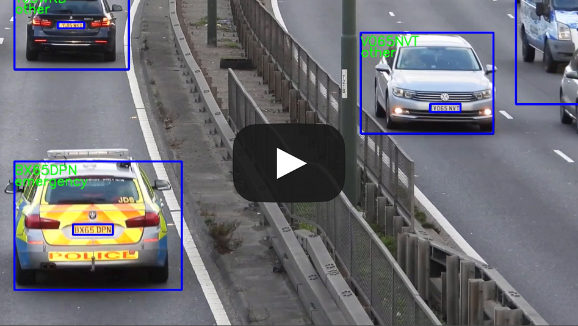

# Automatic number-plate recognition (ALPR)

This is a project that I undertook as a research associate at the University of Westminster. It involved creating an automatic number-plate recognition (ALPR) system. It is split into three main stages, vehicle detection (VD), licence plate detection (LPD) and LP recognition (LPR). A vehicle type classifier (VTC) is also made to classify the detected vehicles into trucks and emergency vehicles.

# Paper

There is a published paper associated with this project, which can be found [here](paper.pdf), or from the [Sensors](https://www.mdpi.com/1424-8220/22/23/9477#) publisher.

## Abstract

An accurate and robust Automatic License Plate Recognition (ALPR) method proves surprising versatility in an Intelligent Transportation and Surveillance (ITS) system. However, most of the existing approaches often use prior knowledge or fixed pre-and-post processing rules and are thus limited by poor generalization in complex real-life conditions. In this paper, we leverage a YOLO-based end-to-end generic ALPR pipeline for vehicle detection (VD), license plate (LP) detection and recognition without exploiting prior knowledge or additional steps in inference. We assess the whole ALPR pipeline, starting from vehicle detection to the LP recognition stage, including a vehicle classifier for emergency vehicles and heavy trucks. We used YOLO v2 in the initial stage of the pipeline and remaining stages are based on the state-of-the-art YOLO v4 detector with various data augmentation and generation techniques to obtain LP recognition accuracy on par with current proposed methods. To evaluate our approach, we used five public datasets from different regions, and we achieved an average recognition accuracy of 90.3% while maintaining an acceptable frames per second (FPS) on a low-end GPU.

## Key contributions

- A fully automated, streamlined, and generalizable ALPR system that does not require any prior knowledge or pre/post processing steps.
- Customized data generation and data augmentation techniques to synthesize new license plates to increase data samples.
- An elementary vehicle classifier that can be expanded on.
- A methodological analysis of the proposed method with preceding works in literature.

# Video demonstration

Below is a video showing the proposed ALPR system working in a real-world application on unseen data.

# ALPR Pipeline

# Data generation

## Data permutations

Data permutations was used to replace high performing characters with a low performing characters. Below are some examples of auto-generated samples.

## Data augmentation

Data augmentation was used to make more challenging samples by adding random shadows, bright blobs, and blur.

## Before and after data generation

More details can be found in the paper.

# Results

## ALPR system
ALPR system comparison to other methods across all datasets.

*The first two stages of the pipeline were skipped. **When considering the UFPR ALPR dataset as a video.

## Individual characters

All characters results across all datasets in the test sets combined.

# Notes

- `/darknet` to run the ALPR pipeline.
- `/datasets` for the datasets used.
- `/vtc` for the VTC stage.
