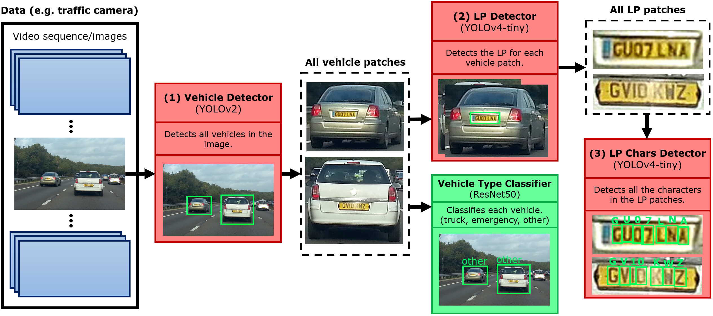

# Automatic number-plate recognition (ALPR)

This is a project that I undertook as a research associate at the University of Westminster. It involves creating an automatic number-plate recognition (ALPR) system. It is split into three main stages, vehicle detection (VD), licence plate detection (LPD) and LP recognition (LPR). A vehicle type classifier (VTC) is also made to classify the detected vehicles into trucks and emergency vehicles.

# Paper

There is a paper associated with this project, which will be shared here when it is finalised.

## Abstract

An accurate and robust Automatic License Plate Recognition (ALPR) method is crucial in any Intelligent Transportation and Surveillance (ITS) system. Such systems are required to have 100\% recognition rate, as one character mistake will lead to the wrong license plate (LP), making this a very challenging task. There have been many attempts in creating a robust ALPR system and great results have been achieved. However, most use prior knowledge such as specific country LP character layouts and fixed pre and post processing rules, which will for example, breakdown with foreign vehicles, personalised LPs, and add an overhead to the pipeline. In this paper, we propose an end-to-end generic ALPR system, that uses no prior knowledge on country LPs layout, with no pre or post processing steps, and achieve competitive results in 5 public datasets. The whole ALPR pipeline is considered, from the vehicle detection to LP detection and finally the LP recognition; including a vehicle classifier for heavy trucks and emergency vehicles in stage one. Each stage of the pipeline is based on the state-of-the-art YOLO detector with various data augmentation and data generation techniques to obtain an LP recognition accuracy that is on par with current proposed methods, and is country independent with no additional steps at inference.

# Pipeline

# Results

| **Dataset**          | **Stage**      | **TP**      | **FN**      | **Recall**      |
|----------------------|:--------------:|:-----------:|:-----------:|:---------------:|
| Caltech cars         |       VD       |      14     |      0      |       100       |
|                      |       LPD      |      13     |      1      |      92.86      |
|                      |       LPR      |      13     |      1      |      92.86      |
| English LP           |       VD       |      52     |      0      |       100       |
|                      |       LPD      |      50     |      2      |      96.15      |
|                      |       LPR      |      50     |      2      |      96.15      |
| AOLP                 |       VD       |     218     |      1      |      99.54      |
|                      |       LPD      |     216     |      3      |      98.63      |
|                      |       LPR      |     214     |      5      |      97.72      |
| Open ALPR            |       VD       |      12     |      0      |       100       |
|                      |       LPD      |      12     |      0      |       100       |
|                      |       LPR      |      12     |      0      |       100       |
| UFPR ALPR            |       VD       |     1800    |      0      |       100       |
|                      |       LPD      |     1769    |      31     |      98.28      |
|                      |       LPR      |     1117    |     683     |      62.06      |
| **Average LPR**      |                |             |             |                 |
| UFPR ALPR as vid     |       LPR      |      44     |      16     |      73.33      |

More results will be added when the paper is finalised.

# Notes

- To run the ALPR pipeline, please refer to `/darknet`.
- For the datasets used, please refer to `/datasets`.
- For only the VTC stage, please refer to `/vtc`.